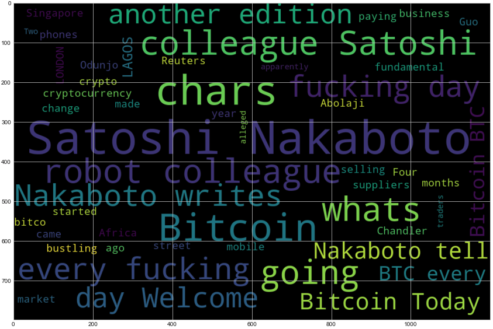
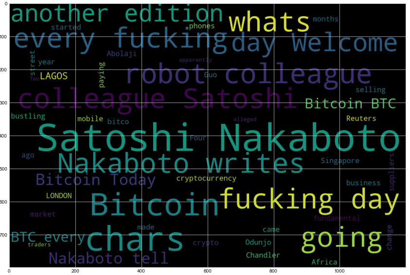
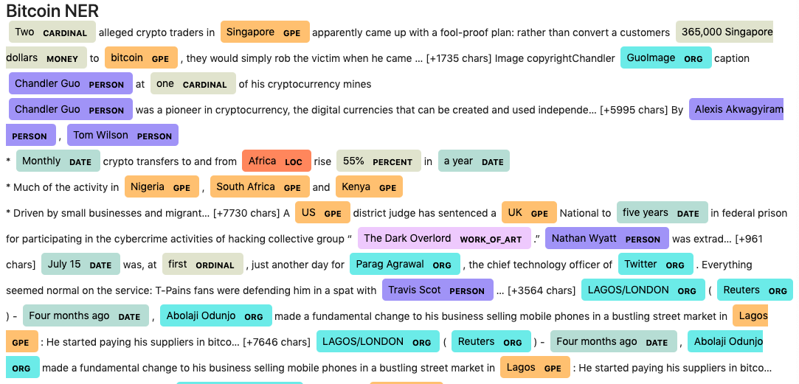
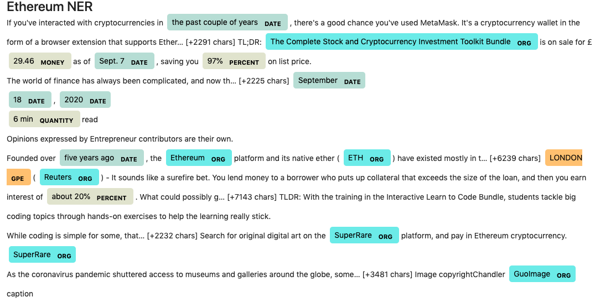

Completed the following tasks:

1. [Sentiment Analysis](#Sentiment-Analysis)

   - Used NEWS API to determine sentiment analysis for Bitcoin and Ehtereum Cryptocurrency

   ### Questions:

Q: Which coin had the highest mean positive score?

A: Ethereum Crypto

Q: Which coin had the highest compound score?

A: Bitcoin Crypto

Q. Which coin had the highest positive score?

A: Bitcoin Crypto

2. [Natural Language Processing](#Natural-Language-Processing)

- Used NTLK Tokenizer to:

1. Lowercase each word
2. Remove Punctuation
3. Remove Stopwords
4. Produce the ngrams for N = 2.
5. Generate word clouds.

3. [Named Entity Recognition](#Named-Entity-Recognition)

#### Named Entity Recognition

Built a named entity recognition model for both coins - Bitcoin and Ethereum

